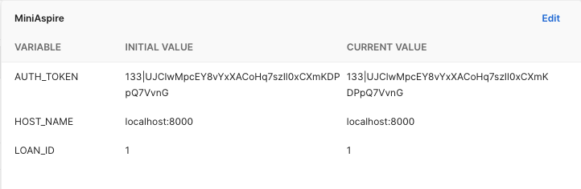
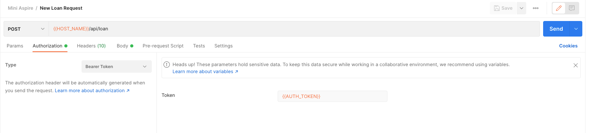
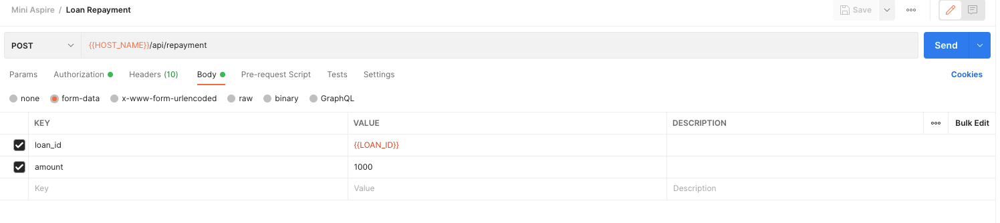
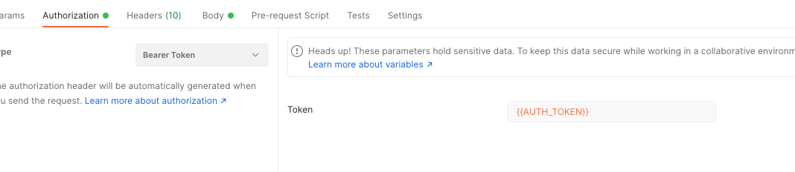

<p align="center"><a href="https://laravel.com" target="_blank"></a></p>

<p align="center">
<a href="https://travis-ci.org/laravel/framework"></a>
<a href="https://packagist.org/packages/laravel/framework"></a>
<a href="https://packagist.org/packages/laravel/framework"></a>
<a href="https://packagist.org/packages/laravel/framework"></a>
</p>

## Project Definition

Your task is to build a mini-aspire API:

It is an app that allows authenticated users to go through a loan application. It doesn’t have to contain too many fields, but at least “amount required” and “loan term.” All the loans will be assumed to have a “weekly” repayment frequency.

After the loan is approved, the user must be able to submit the weekly loan repayments. It can be a simplified repay functionality, which won’t need to check if the dates are correct but will just set the weekly amount to be repaid.

## Project Installation Guide

### Server Requirements

- PHP >= 7.3
- BCMath PHP Extension
- Ctype PHP Extension
- Fileinfo PHP Extension
- JSON PHP Extension
- Mbstring PHP Extension
- OpenSSL PHP Extension
- PDO PHP Extension
- Tokenizer PHP Extension
- XML PHP Extension

### Installation (Laravel v8.x)
Clone project using below repository

```
$ git clone git@github.com:vhkhb/miniapire.git
```

Copy .env.example to .evn file

```angular2html
cp .env.example .env 
```

Set below variable to .env file
```
DB_DATABASE=laravel
DB_USERNAME=root
DB_PASSWORD=
TOKEN_NAME="PRIVATE KEY IF YOU WANT TO CHANGE"
```
> NOTE: Make sure you already created Database in MySQL

Goto the project root folder and run composer install using below command
```
$ composer install
```

### Migration and Seed

To run below command for migration and seeder.
```
$ php artisan migrate:fresh --seed
```

Regenerate key for the application
```
$ php artisan key:generate
```

### User Credentials

#### Email: demouser@example.com
#### Password: password

### Test Cases

If you want to run the test cases, please run the blow command
```
$ php artisan test
```


<hr/>

## Postman Guide

>NOTE: We need to store 3 variables in post like below either Globally or Locally.

```
HOST_NAME - (Set here your localhost url)

AUTH_TOKEN - (Once you logged in then you will get token pleae set that token here.)

LOAN_ID - (Once you request for new loan you will get loan id set that loan id here.)
```

> NOTE: Please set Authorization Type <b>"Bearer Token"</b> for the APIs of <b>"New Loan Request", "Loan Repayment", "Loan Status Change"</b>
#### For more reference review below images.








> NOTE: I shared with you json file of Postman Collection with name of <b>"postman_collection.json"</b>
